# 🌿 EcoScore AI — Universal Sustainability Auditor & Gamified Carbon Tracker

[](https://chrome.google.com/webstore)
[](https://nodejs.org)
[](https://ai.google.dev)
[](https://console.cloud.google.com)

**EcoScore AI** is a state-of-the-art browser companion and backend suite that brings real-time, AI-driven carbon footprint analysis and sustainability auditing to **any shopping website in the world** — including Amazon, Flipkart, eBay, Etsy, Walmart, and Shopify storefronts.

By combining e-commerce scrapers with Google's **Gemini AI**, EcoScore estimates the lifecycle carbon footprint (kg CO₂) of items, awards a color-coded letter grade, explains the score, and lists greener alternatives. It syncs stats to a secure database via **Google OAuth Single Sign-on** and tracks user ranks inside a gamified dashboard.

---

## 📸 Architectural Workflow

The diagram below details the data synchronization between the e-commerce webpage, the extension background service worker, Google API endpoints, and our secure server database:

```mermaid
sequenceDiagram
    autonumber
    actor User as Shopper (Amazon/Flipkart)
    participant CS as Content Script (content.js)
    participant BG as Service Worker (background.js)
    participant Gem as Google Gemini API
    participant API as Express API Server
    participant DB as JSON DB (Atomic Writes)

    User->>CS: Navigate to product page
    CS->>CS: Scraping title, keywords & category
    CS->>BG: Message: ECO_GET_ALTERNATIVES (Title, Materials)
    
    rect rgb(30, 41, 59)
        note right of BG: Resolving Gemini API Key
        BG->>Gem: POST /generateContent (Gemini-1.5-Flash + Prompts)
        Gem-->>BG: Returns Sustainability Score, CO₂ & 3 Alternatives
    end

    BG-->>CS: Sends grading payload (Score, Alternatives, CO₂)
    CS->>User: Displays interactive floating Widget (updateWidgetWithAI)

    opt If User is Authenticated (Google SSO)
        CS->>BG: Message: ECO_RECORD_SCAN (Score, Carbon Saved)
        BG->>API: POST /api/user/scan (googleId, score, carbonSaved)
        API->>DB: Atomic write (users.db.json)
        DB-->>API: Write confirmed safely
        API-->>BG: Returns updated profile stats & rank progress
        BG->>CS: Updates on-screen profile metrics
    end
```



---

## ✨ Features

### 1. 🤖 AI-Powered Sustainability Audits
* **Direct Gemini Integration:** Utilizes Google's `gemini-1.5-flash` model to analyze e-commerce keywords and estimate precise, context-aware lifecycle carbon footprints (measured in kg CO₂ equivalent).
* **AI-Generated Alternatives:** Suggests exactly 3 commercially available, functional replacements with green labels, search queries, and purchase channels.
* **Why This Score Explainer:** Delivers a non-generic, high-density explanation (under 22 words) detailing exactly why the product received its score based on raw material components and production waste.

### 2. 🔐 Secure Google Single Sign-On (OAuth 2.0)
* **Manifest V3 Identity API:** Seamlessly obtains Google authorization tokens natively inside the Chrome service worker via `chrome.identity.getAuthToken`.
* **Server-Side Token Verification:** Instead of blindly trusting client tokens, our backend exchanges user credentials directly with Google’s `/userinfo` endpoint for absolute profile integrity.
* **Onboarding Experience:** Automatically launches a centered full-browser onboarding tab on initial extension installation.

### 3. 📊 Gamified Carbon Tracking & Leaderboard
* **Centered Desktop Dashboard:** Rebuilt to display a premium **960px widescreen layout** when opened in a tab. Includes an elegant side-by-side **3-column analytics grid**.
* **Progressive Ranks:** Users level up based on cumulative CO₂ offset savings (kg):
  - 🌱 **Susty Novice** (`< 2.0 kg` saved)
  - ⚡ **Susty Warrior** (`2.0 - 10.0 kg` saved)
  - 🏹 **Carbon Crusader** (`10.0 - 30.0 kg` saved)
  - 🌟 **Climate Champion** (`30.0+ kg` saved)

### 4. 🎛️ Premium Floating Widget
* **Smooth 2D Dragging:** Leverages **Pointer Events** and `setPointerCapture` to allow frictionless dragging anywhere on e-commerce sites, fully bypassing Flipkart/Amazon zoom lenses and carousel freeze traps.
* **SVG Ring Gauges:** Animated vector rings color-code product ratings seamlessly (Green for Exceptional `A+`, Orange for Poor `C`, Red for Harmful `D`).

### 5. 🏪 High-Fidelity Web Store Preview (`preview.html`)
* **Mock Listing page:** Matches the official Google Chrome Web Store look, complete with compatibility tags, ratings, and a blue **"Add to Chrome"** action button.
* **Functional Modal & Toast:** Clicking install opens an interactive visual modal demonstrating unpacked extension loading. Clicking "Add to Cart" displays a premium, custom floating toast notification.

---

## 🗂️ Project Directory Map

```
EcoScore/
├── manifest.json        # Chrome Extension MV3 configuration
├── background.js        # Background worker: handles OAuth, Storage & Gemini API
├── content.js           # Page scrapper, widget injection & pointer dragging
├── ecoDatabase.js       # Regex e-commerce classification & material thresholds
├── popup.html           # Toolbar popup dashboard & onboarding panel
├── popup.css            # Widescreen 960px desktop & compact toolbar popup styles
├── popup.js             # SSO triggers, stats updates, and ranking calculations
├── widget.css           # Glowing green-accented floating widget styles
├── preview.html         # Chrome Web Store simulation with guides & clickable simulator
├── assets/              # Standard branding assets (16px, 32px, 48px, 128px icons)
└── backend/             # Secure Node.js Express server
    ├── server.js        # Helmet headers, rate-limiting & SSO token routing
    ├── database.js      # JSON flat database equipped with Atomic Writes
    ├── scoreEngine.js   # Algorithmic backup carbon estimation routines
    ├── package.json     # Node script configuration & server dependency listing
    └── users.db.json    # Local persisted memory database
```

---

## 🚀 Widescreen Installation & Local Setup

### Frontend Chrome Extension (Local Load)
1. Open Google Chrome and navigate to `chrome://extensions/`
2. Toggle the **"Developer mode"** switch to **ON** in the top-right corner.
3. Click the **"Load unpacked"** button in the top-left corner.
4. Browse and select the primary **`EcoScore Browser Extension`** directory.
5. The green leaf icon will appear in your extensions list. Visit any Amazon or Flipkart product page!

### Secure Backend Server Setup
To support statistics tracking, rankings, and Google Profile syncing, launch your local backend server:

```bash
# Navigate to the backend directory
cd backend

# Install secure dependencies (express, cors, helmet, express-rate-limit)
npm install

# Start the Express server
npm start
```
*The server will start listening at `http://localhost:5000` with clean console routes mapped.*

---

## 🔑 Configuration & API Keys

### Google Cloud OAuth Client ID (Google SSO)
To allow your public users to use Google Sign-in, register your extension ID inside the Google Console:
1. Go to the **[Google Cloud Console Credentials Page](https://console.cloud.google.com/apis/credentials)**.
2. Click **Create Credentials** > **OAuth Client ID** and select **Chrome app**.
3. Under the **Application ID** field, paste your immutable 32-letter Chrome Extension ID (found on `chrome://extensions` once loaded or published).
4. Paste the client ID in your `manifest.json` under `"oauth2" > "client_id"`.

### Gemini API Key Configuration
EcoScore is equipped with an out-of-the-box verified default Gemini fallback key. However, users can manage keys securely:
* **Option A (Self-Provided Key):** Go to the **AI Setup** tab inside the toolbar popup, click the link to get a free key in Google AI Studio, paste it into the field, and save. The key is saved locally in your secure `chrome.storage.sync` area.
* **Option B (Proxy Backend Key):** For large deployments, route requests to your cloud server and define your private key inside the Node environment variables (`process.env.GEMINI_KEY`) to hide it completely from client browser files.

---

## 🌐 Secure Backend API Specification

The Node Express backend enforces global rate-limiting (maximum 150 requests per 15-minute window per IP) and secure `helmet` headers.

### 1. Diagnostic Health Check
* **Route:** `GET /health`
* **Response `200 OK`:**
```json
{
  "status": "healthy",
  "service": "EcoScore Secure API",
  "version": "2.0.0",
  "databaseUsers": 2,
  "systemScans": 16
}
```

### 2. Google OAuth Profile Sync
* **Route:** `POST /api/auth/google`
* **Payload:**
```json
{ "accessToken": "ya29.a0AfB_..." }
```
* **Description:** Exposes the token to Google API `/userinfo` to verify profile ID, email, picture, and registers/updates their database entry.

### 3. Developer Sandbox Login
* **Route:** `POST /api/auth/sandbox`
* **Description:** Instantly registers and returns a developer sandbox profile (`googleId: "sandbox_dev_1337"`) to allow database stats tracking, progression, and dashboard checks without requiring live credentials.

### 4. Record Scanned Product
* **Route:** `POST /api/user/scan`
* **Payload:**
```json
{
  "googleId": "1084209581903",
  "score": 92,
  "carbonSaved": 2.5
}
```
* **Description:** Records the scanned score, increments pagesScanned, accumulates carbonSavedKg, and syncs updated metrics.

### 5. Fetch User Profile
* **Route:** `GET /api/user/:googleId`
* **Description:** Retrieves the specified user profile's statistics, cumulative carbon offsets, and registered sign-in details.

---

## 🔒 Security Hardening Standards

1. **Atomic File-based Writes (`database.js`):**
   To prevent JSON database corruption during sudden server crashes or restarts, all database saves are committed **atomically**. The server writes updates to a unique temporary file (`users.db.json.tmp`) and executes a synchronous directory rename. If the system fails mid-write, the existing database remains 100% intact.
2. **Helmet Security Middlewares (`server.js`):**
   Protects the backend from common web vulnerabilities by configuring secure HTTP response headers (XSS filters, Frameguard, MIME sniffing controls).
3. **Restricted CORS Policy mapping:**
   CORS parameters restrict connections exclusively to Chrome Extension origins (`chrome-extension://<32-letter-id>`), localhost ports, and local loopbacks, rejecting arbitrary web requests.
4. **Manifest V3 Content Security Policy (CSP):**
   `popup.html` fully complies with the strict MV3 CSP. Inline `onclick` script handlers have been removed and replaced with dynamic DOM listeners inside `popup.js`, blocking script injection opportunities.

---

*EcoScore AI — Making every shopping cart a greener choice 🌍*
